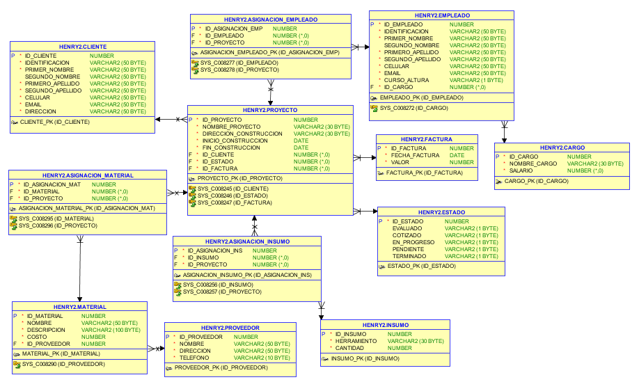

# MODEL

Modelo de datos, proyecto Rembryn.

## operations

1. [x] Control de flujo
1. [x] Excepciones de error.
1. [x] Triggers
1. [x] Procedimientos Almacenados
1. [x] Funciones
1. [x] Manejo de ciclos
1. [x] Records
1. [x] Cursores

## Tools

- Oracle11G

